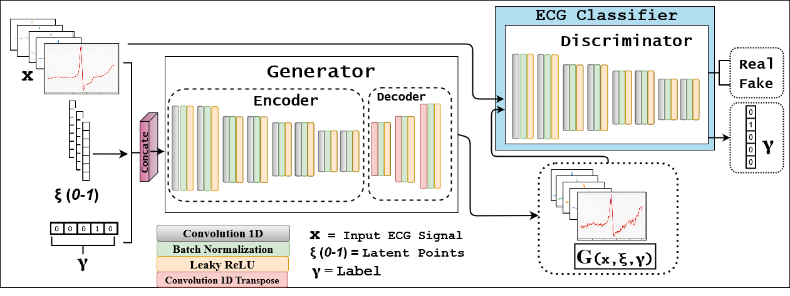

#2021 20th IEEE International Conference on Machine Learning and Applications (ICMLA)

### DOI:
```
10.1109/ICMLA52953.2021.00016
```

# Citation
```
@article{fariha2021ecg,
  title={ECG-Adv-GAN: Detecting ECG Adversarial Examples with Conditional Generative Adversarial Networks},
  author={Fariha Hossain, Khondker and Amit Kamran, Sharif and Tavakkoli, Alireza and Pan, Lei and Ma, Xingjun and Rajasegarar, Sutharshan and Karmaker, Chandan},
  journal={arXiv e-prints},
  pages={arXiv--2107},
  year={2021}
}
```


ECG-Adv-GAN: Detecting ECG Adversarial Examples with Conditional Generative Adversarial Networks.




## Pre-requisite
- Ubuntu 18.04 / Windows 7 or later
- NVIDIA Graphics card


## Installation Instruction for Ubuntu
- Download and Install [Nvidia Drivers](https://www.nvidia.com/Download/driverResults.aspx/142567/en-us)
- Download and Install via Runfile [Nvidia Cuda Toolkit 10.0](https://developer.nvidia.com/cuda-10.0-download-archive?target_os=Linux&target_arch=x86_64&target_distro=Ubuntu&target_version=1804&target_type=runfilelocal)
- Download and Install [Nvidia CuDNN 7.6.5 or later](https://developer.nvidia.com/rdp/cudnn-archive)
- Install Pip3 and Python3 enviornment
```
sudo apt-get install pip3 python3-dev
```
- Install Tensorflow-Gpu version-2.0.0 and Keras version-2.3.1
```
sudo pip3 install tensorflow-gpu==2.0.0
sudo pip3 install keras==2.3.1
```
- Install packages from requirements.txt
```
sudo pip3 install -r requirements.txt
```
