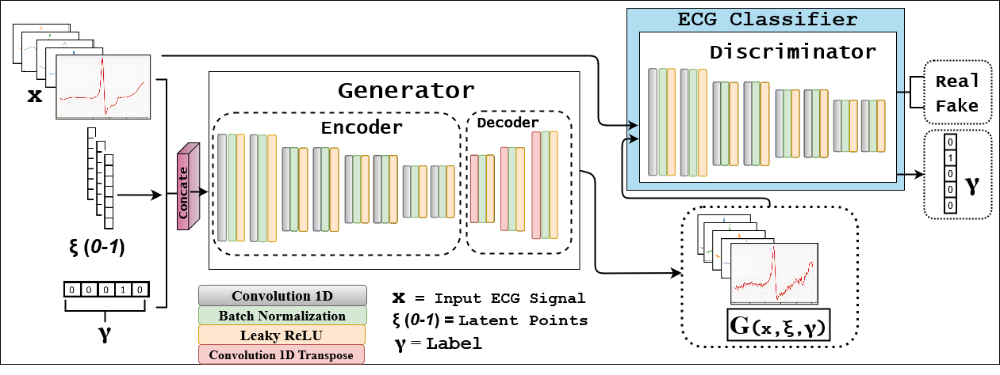
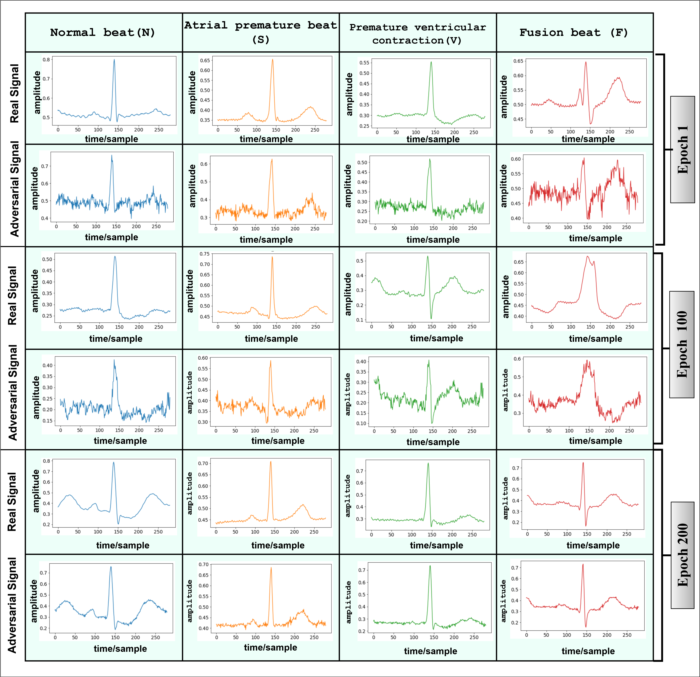

[](LICENSE)
[](https://arxiv.org/abs/2107.07677)
[](https://ieeexplore.ieee.org/abstract/document/9680168?casa_token=YbMda7tPoWUAAAAA:CxrDZwe2aV9bybihfA6qwykpcPb7dwVNMJCeDjuyoGE1S8Q0pLCkbgDmoVKOpSSlAu7r8g)

# \[ICMLA 2021\] ECG-Adv-GAN: Detecting ECG AdversarialExamples with Conditional Generative Adversarial Networks


Official implementation of \[ICMLA 2021\] [**ECG-Adv-GAN: Detecting ECG AdversarialExamples with Conditional Generative Adversarial Networks**](https://arxiv.org/abs/2110.09983).

\[[Paper](https://arxiv.org/abs/2107.07677)\]\[[BibTex](#citing-ECG-Adv-GAN)\]

<br clear="left"/>

---

## Abstract
Electrocardiogram (ECG) acquisition requires an automated system and analysis pipeline for understanding specific rhythm irregularities. Deep neural networks have become a popular technique for tracing ECG signals, outperforming human experts. Despite this, convolutional neural networks are susceptible to adversarial examples that can misclassify ECG signals and decrease the model's precision. Moreover, they do not generalize well on the out-of-distribution dataset. The GAN architecture has been employed in recent works to synthesize adversarial ECG signals to increase existing training data. However, they use a disjointed CNN-based classification architecture to detect arrhythmia. Till now, no versatile architecture has been proposed that can detect adversarial examples and classify arrhythmia simultaneously. To alleviate this, we propose a novel Conditional Generative Adversarial Network to simultaneously generate ECG signals for different categories and detect cardiac abnormalities. Moreover, the model is conditioned on class-specific ECG signals to synthesize realistic adversarial examples. Consequently, we compare our architecture and show how it outperforms other classification models in normal/abnormal ECG signal detection by benchmarking real world and adversarial signals.
<div align="left">
  
</div>


## Training


## Results
### Visualize-Output:
Each pair of row contains real and adversarial signal for Epoch 1,100 and 200 successively.The column consists of different ECG signals such as Normal (N), Atrial Premature (A), Premature Ventricular (V), and Fusion (F) beats, and for each graph, the X-axis signifies sample/time in range of [0,280] and Y-axis signifies amplitude of [0,1]. We can see that our ECG-adv-GAN synthesizes realistic-looking adversarial ECGs over time
<div align="left">
  
</div>


## Citing ECG-Adv-GAN

If you find this repository useful, please consider giving a star and citation:

#### ICMLA 2021 Reference:
```bibtex
@inproceedings{hossain2021ecg,
  title={ECG-Adv-GAN: detecting ECG adversarial examples with conditional generative adversarial networks},
  author={Hossain, Khondker Fariha and Kamran, Sharif Amit and Tavakkoli, Alireza and Pan, Lei and Ma, Xingjun and Rajasegarar, Sutharshan and Karmaker, Chandan},
  booktitle={2021 20th IEEE International Conference on Machine Learning and Applications (ICMLA)},
  pages={50--56},
  year={2021},
  organization={IEEE}
}
```
